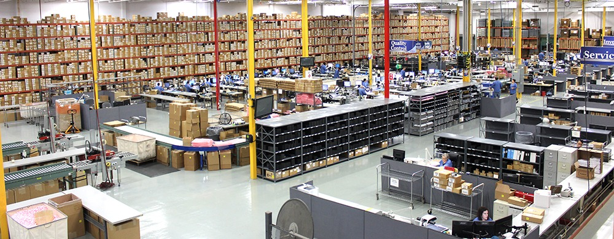

# Global Electronics-Retailers

## Introduction
A Power BI project that examines various aspects of transactional data for a global electronics retailer business such as sales performance trends, product productivity, customer behavior, and currency impacts on revenue.
## Table Of Content
- Project Overview
- Project Scope
- Business Objective
- Document Purpose
- Use Case
- Skills Demonstrated
- Data Source
- Data Cleaning and Processing
- Data Analysis and Insight
- Recommendation
- Conclusion
## Project Overview  
This project aims to provide Electronics Retailer with actionable insights derived from sales analysis and to offer practical insights into product profitability, seasonal patterns or trends for order revenue, customers location, average delivery time, currency exchange rates and the differences between in-store sales vs online orders using Power BI.  
The project will provide Mavin Global Electronics Retailer with the tools and knowledge needed to make informed decisions and pinpoint important areas in need of enhancement and optimization.

## Project Scope
This project entails a thorough analysis of Maven transactional data for a fictitious global electronics retailer, focusing on customers, stores, exchange rate levels, daily sales and products.
 The analysis covers data from January 1, 2016, to February 20, 2021, to provide a comprehensive view of electronics retailer operational performance.
## Business Objective
The main goal of the electronics retailer project is to find the types of products the company sells, where their customers are located and check if these categories are consistently profitable in online vs in-store sales. It also seeks to ascertain the patterns and trends in sales over different time periods. 
## Document Purpose
This documentation serves as a guide for project stakeholders, providing insights into the project's objectives, data sources, data analysis, visualization and any other relevant information.
## Use Case
This analysis project for Maven Global Electronics Retailers would provide valuable insights and improvements across various operational aspects. Different stakeholders within the organization could leverage these findings to enhance their respective functions. The following important parties may find this analysis useful and advantageous.

**1.Customer services and sales representatives:**
- Application of Analysis:  Real-time order tracking, enhanced channels of communication, and a deeper comprehension of customer concerns and preferences can all be advantageous to sales representatives and customer support. 
-Benefits: Improved client retention, higher sales, and higher levels of satisfaction with customers.

**2. Supervisors of Operations:**
- Application of Analysis: By utilizing insights, operations managers can increase overall productivity in daily operations by optimizing inventory levels, streamlining order fulfillment procedures, and improving overall efficiency.
- Benefits: include decreased operating expenses, increased output, and faster order fulfillment.

**3. Marketing Team:**

- Application of Analysis: Knowledge of consumer preferences, satisfaction levels, and general market trends can be advantageous to the marketing department. 

- Benefits: include higher revenue, improved client interaction, and more targeted marketing strategies.  

**Skills/ Concepts Demonstrated**
- Data Connection in Microsoft Power BI
- Data Profiling
- Data Cleaning and Transformation in Power Query
- Data Modelling
- Data Analysis
- Data Visualization
# Data Source
The project utilizes a dataset containing information on sales and orders. The dataset used for this analysis was downloaded from  [Maven Analytics](https://mavenanalytics.io/data-playground?page=1&pageSize=5) website where datasets are available for practice purposes. The dataset is a CSV file, and it consists of five main tables which are product table, customer table, sales table, store table and exchange rate table.

The product table contains information about the goods the electronics retailers sell and their brands. It has 2517 rows and 10 columns which are product key, product name, brand, color, unit cost, unit price, subcategory key, subcategory, category and category key. product key is the primary key for each product, product name is the name of each product in the dataset, brand is the various brands of the product, unit cost is the cost to produce the product (USD), unit price is the current price per unit of the product (USD), category key is the ID to identify the category the product belongs to and the category is the name product category name.
The customer table contains information about customers. It has 15266 rows and 10 columns which are customer key, gender, name, city, state code, state, zip code, country, continent, and birthday. The customer key is the primary key to identify each customer, customer Gender is the gender of each customer, customer name is the full name of the customer, customer country is the country each customer is located, and birthday is the customer date of birth.
The sales table offers insights into daily sales activity and records the quantity of products sold. It has 62884 rows and 9 columns. which are order number, line number, order date, delivery date, customer key, store key, product key, quantity and currency code. The order number is the unique ID for each order, line item identifies individual products purchased as part of an order, order date is the date when the order was placed, delivery date is the date when the order was delivered, customer key column is the unique key identifying which customer placed the order, store key is the unique key identifying which store processed the order, product key is the unique key identifying which product was purchased, quantity is the number of items purchased, and lastly, currency code is the currency used to process the order.

The store table comprises 67 rows and 5 columns. The columns include store key, country, state, square meters, open date. The store key is the primary key to identify stores, country is the country each store is located, state is the location of each state in the various countries and lastly, square meters is the store footprint in square meters.
The exchange rate table lists the exchange rates for various currencies against a base currency (USD). It has 11215 rows and 3 columns which are date, currency and exchange.

