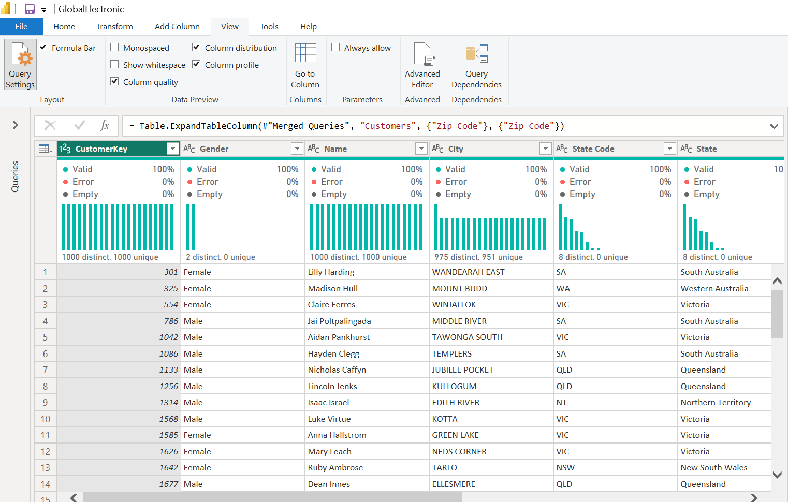

# Global Electronics-Retailers

## Introduction
A Power BI project that examines various aspects of transactional data for a global electronics retailer business such as sales performance trends, product productivity, customer behavior, and currency impacts on revenue.
## Table Of Content
- Project Overview
- Project Scope
- Business Objective
- Document Purpose
- Use Case
- Skills Demonstrated
- Data Source
- Data Cleaning and Processing
- Data Analysis and Insight
- Recommendation
- Conclusion
## Project Overview  
This project aims to provide Electronics Retailer with actionable insights derived from sales analysis and to offer practical insights into product profitability, seasonal patterns or trends for order revenue, customers location, average delivery time, currency exchange rates and the differences between in-store sales vs online orders using Power BI.  
The project will provide Mavin Global Electronics Retailer with the tools and knowledge needed to make informed decisions and pinpoint important areas in need of enhancement and optimization.

## Project Scope
This project entails a thorough analysis of Maven transactional data for a fictitious global electronics retailer, focusing on customers, stores, exchange rate levels, daily sales and products.
 The analysis covers data from January 1, 2016, to February 20, 2021, to provide a comprehensive view of electronics retailer operational performance.
## Business Objective
The main goal of the electronics retailer project is to find the types of products the company sells, where their customers are located and check if these categories are consistently profitable in online vs in-store sales. It also seeks to ascertain the patterns and trends in sales over different time periods. 
## Document Purpose
This documentation serves as a guide for project stakeholders, providing insights into the project's objectives, data sources, data analysis, visualization and any other relevant information.
## Use Case
This analysis project for Maven Global Electronics Retailers would provide valuable insights and improvements across various operational aspects. Different stakeholders within the organization could leverage these findings to enhance their respective functions. The following important parties may find this analysis useful and advantageous.

**1.Customer services and sales representatives:**
- Application of Analysis:  Real-time order tracking, enhanced channels of communication, and a deeper comprehension of customer concerns and preferences can all be advantageous to sales representatives and customer support. 
-Benefits: Improved client retention, higher sales, and higher levels of satisfaction with customers.

**2. Supervisors of Operations:**
- Application of Analysis: By utilizing insights, operations managers can increase overall productivity in daily operations by optimizing inventory levels, streamlining order fulfillment procedures, and improving overall efficiency.
- Benefits: include decreased operating expenses, increased output, and faster order fulfillment.

**3. Marketing Team:**

- Application of Analysis: Knowledge of consumer preferences, satisfaction levels, and general market trends can be advantageous to the marketing department. 

- Benefits: include higher revenue, improved client interaction, and more targeted marketing strategies.  

**Skills/ Concepts Demonstrated**
- Data Connection in Microsoft Power BI
- Data Profiling
- Data Cleaning and Transformation in Power Query
- Data Modelling
- Data Analysis
- Data Visualization
# Data Source
The project utilizes a dataset containing information on sales and orders. The dataset used for this analysis was downloaded from  [Maven Analytics](https://mavenanalytics.io/data-playground?page=1&pageSize=5) website where datasets are available for practice purposes. The dataset is a CSV file, and it consists of five main tables which are product table, customer table, sales table, store table and exchange rate table.

**The product table** contains information about the goods the electronics retailers sell and their brands. It has 2517 rows and 10 columns which are product key, product name, brand, color, unit cost, unit price, subcategory key, subcategory, category and category key. product key is the primary key for each product, product name is the name of each product in the dataset, brand is the various brands of the product, unit cost is the cost to produce the product (USD), unit price is the current price per unit of the product (USD), category key is the ID to identify the category the product belongs to and the category is the name product category name.

**The customer table** contains information about customers. It has 15266 rows and 10 columns which are customer key, gender, name, city, state code, state, zip code, country, continent, and birthday. The customer key is the primary key to identify each customer, customer Gender is the gender of each customer, customer name is the full name of the customer, customer country is the country each customer is located, and birthday is the customer date of birth.

**The sales table** offers insights into daily sales activity and records the quantity of products sold. It has 62884 rows and 9 columns. which are order number, line number, order date, delivery date, customer key, store key, product key, quantity and currency code. The order number is the unique ID for each order, line item identifies individual products purchased as part of an order, order date is the date when the order was placed, delivery date is the date when the order was delivered, customer key column is the unique key identifying which customer placed the order, store key is the unique key identifying which store processed the order, product key is the unique key identifying which product was purchased, quantity is the number of items purchased, and lastly, currency code is the currency used to process the order.

**The store table** comprises 67 rows and 5 columns. The columns include store key, country, state, square meters, open date. The store key is the primary key to identify stores, country is the country each store is located, state is the location of each state in the various countries and lastly, square meters is the store footprint in square meters.

**The exchange rate table** lists the exchange rates for various currencies against a base currency (USD). It has 11215 rows and 3 columns which are date, currency and exchange.

# Data Connection Details
In Power BI, connecting to a CSV file involves specifying the location of the CSV file and defining the data import settings.
The procedures for connecting data in Power BI are listed below.

##### 1.Open Power BI Desktop
- Launched power BI Desktop on computer

##### 2.Get Data
- Clicked on the "Home" tab in the Power BI Desktop.
- Selected "Get Data" to initiate the data import process.

##### 3. Choose Text/CSV and Specify the File Location
	- In the "Get Data" window, select "Text/CSV" as the data source.
	- Navigated to the location where the CSV file is stored.
	- Selected the CSV file I want to import and clicked "Open."

##### 4.Preview and Transform
- Power BI displayed a preview of the data from the CSV file.
- Reviewed the data to ensure it is displayed correctly.

# Data Profiling
Using Power BI's data profiling feature, one can examine and analyze the qualities and features of data to learn more about its structure, trends, possible problems, and outliers. 
It helps to make informed decision on data cleaning and transformation. Data profiling is made easier with Power BI's array of features and tools.  These are column quality, column distribution and column profile.

**Data Profile on Key Column on Product Table**

_**1.Basic information**_
- Table name: Product Table
- Number of Rows: 2517
- Number of key Columns: 10
  
_**2.Column Profile**_
|Column Name|Datatype|Distinct Value|Unique Value| % Valid Values| % Error Values| % Empty Values|
|-----------|--------|--------------|------------|---------------|--------------|--------------|
|Productkey|Whole Number|1000|1000|100|0|0|
|Productkey|Text |1000|1000|100|0|0|

_**3. Data Quality Checks**_
- Missing Values:
- Product key: 0
- Product Name: 0
- Brand: 0
- Color: 0
- Unit Cost USD: 0
- Unit Price USD: 0
- Category: 0
- Category Key: 0
- SubCategory: 0
- SubCategory key: 0
- Duplicates: This table has no duplicate value

**Data Profile on Key Column on Customer Table**

_**1.Basic information**_
- Table name: Customer Table
- Number of Rows: 15266
- Number of key Columns: 10
  
_**2.Column Profile**_

_**3. Data Quality Checks**_
- Missing Values:
- Customer key: 0
- Name: 0
- Gender: 0
- City: 0
- State
- State Code: 0
- Country: 0
- Zip Code: 0
- Continent: 0
- Birthday: 0
- Duplicates: This table has no duplicate value

  **Data Profile on Key Column on Store Table**

_**1.Basic information**_
- Table name: Store Table
- Number of Rows: 67
- Number of key Columns: 5
  
_**2.Column Profile**_

_**3. Data Quality Checks**_
- Missing Values:
- Store key: 0
- Country: 0
- State: 0
- Square Meters: 0
- Open Date: 0
- Duplicates: This table has no duplicate value

  **Data Profile on Key Column on Sales Table**

_**1.Basic information**_
- Table name: Sales Table
- Number of Rows: 62884
- Number of key Columns: 9
  
_**2.Column Profile**_

_**3. Data Quality Checks**_
- Missing Values:
- Order Number: 0
- Line Item: 0
- Order Date: 0
- Delivery Date: 857 (86%)
- CustomerKey: 0
- StoreKey: 0
- ProductKey: 0
- Quantity: 0
- CurrencyCode: 0
- Duplicates: This table has no duplicate value

**Data Profile on Key Column on Exchange Rate Table**
|
_**1.Basic information**_
- Table name: Exchange Rate Table
- Number of Rows: 11215
- Number of key Columns: 3
  
_**2.Column Profile**_

_**3. Data Quality Checks**_
- Missing Values:
- Date: 0
- Currency: 0
- Exchange: 0
- Duplicates: This table has no duplicate value

# Data Cleaning and Processing
The process of cleaning data in Power BI involves utilizing the Power Query Editor, an effective tool for shaping and modifying data prior to its loading into the Power BI data model. High levels of accuracy, consistency, quality, and integrity can all be attained with the aid of data cleaning. The insight obtained from data profiling indicates that the dataset used in this analysis is well-structured, consistent, and free of significant errors that might complicate analysis or interpretation. Each column has the correct data type assigned to it, the data values are accurate, and there are no duplicate records. Consistent naming conventions and uniform formatting are employed throughout the data.
As a result, no further cleaning is needed. The following process was carried out during data processes.

**_Added a new table_**
A calendar table was added. This table was marked as a date table. Marking a calendar table as a date table in Power BI enhances time-based calculations, navigation, and interactions within Power BI reports. When a calendar table is marked as date table, it’s like telling Power BI that the table contains date-related information, allowing the system to optimize certain functionalities such as Time Intelligence Functions.

The calendar table contains seven columns which are Date, Month Name, Month Number, Quarter, Year, Weekday Name, Weekday Number. A calendar table also helps to create a date hierarchy, providing a natural and intuitive way to drill down into data. Users can easily navigate from year to month, enhancing the overall user experience.

# Data Modelling
Data modeling in Power BI involves structuring and organizing data to create meaningful relationships between different tables. A well-designed data model is essential for building accurate and insightful reports. Established an active relationship between tables using common fields (keys), examined the relationships diagram to ensure that relationships between tables are correctly defined and accurately represent the connections between tables. 

When a relationship is being created between two tables, Power BI assumes it's an active relationship unless it has been specified otherwise. Active relationships are used for most calculations and visualizations. Reviewed cardinality (e.g., one-to-many) and cross-filtering settings for each relationship. Cardinality defines the nature of relationships that exist between tables, it explains how one table relates to the other. This helped to ensure accurate and meaningful results in reports. Cross-filtering direction refers to the direction in which filter flows between two related tables. Properly set cross-filter direction for creating effective relationships data model and ensured that reports accurately reflect the intended relationships between tables.

# Data Analysis and Insight
The objective of this analysis is to understand seasonal sales trends for order volume and revenue, identify the types of products sold, customers’ location, recognize key customers and orders online vs in-store sales.
This analysis provides answers to the following questions?

 **1.What types of products does the company sell, and where are customers located?**
 

